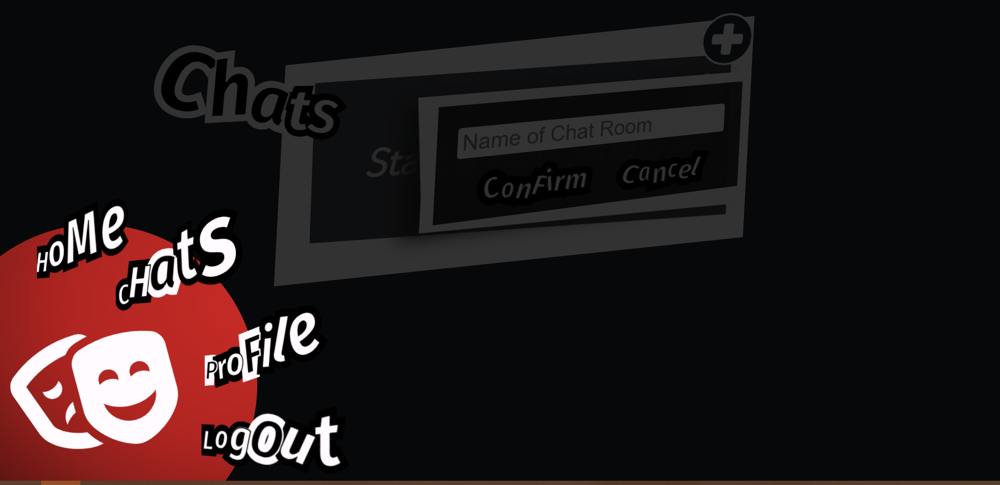
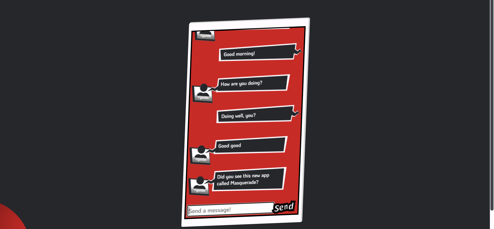

# Project: Masquerade

## Preview

A messaging app themed after the game Persona 5




## Development

0. Install Node.js and npm
1. Install and start Redis: `service redis-server start`
2. Install Typescript and transpile server code:

```
cd server
tsc
```

3. Start the server:

```
cd server
node dist/app.js
```

4. Install Angular CLI and start the client

```
cd client
ng serve
```
